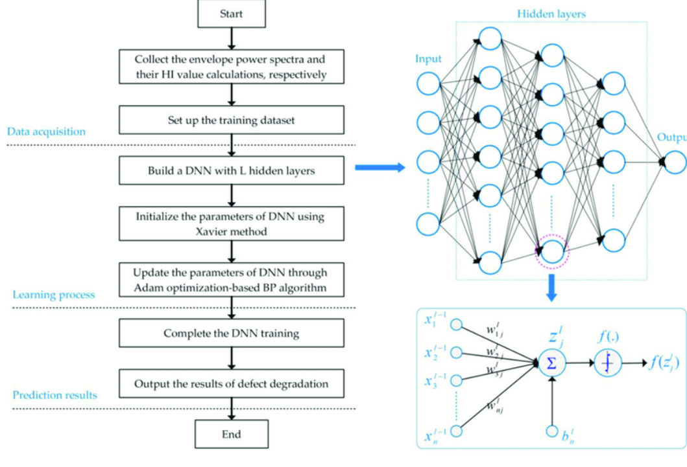
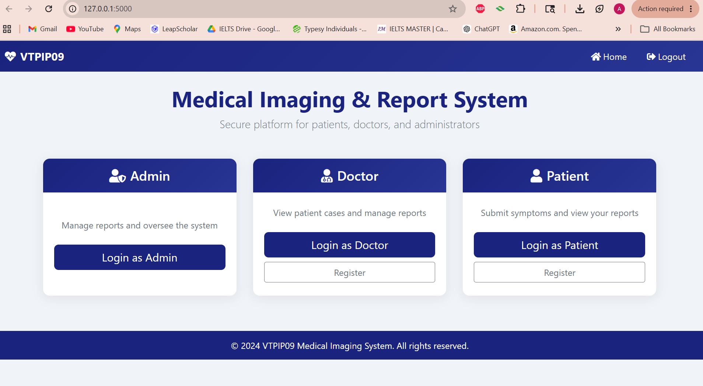
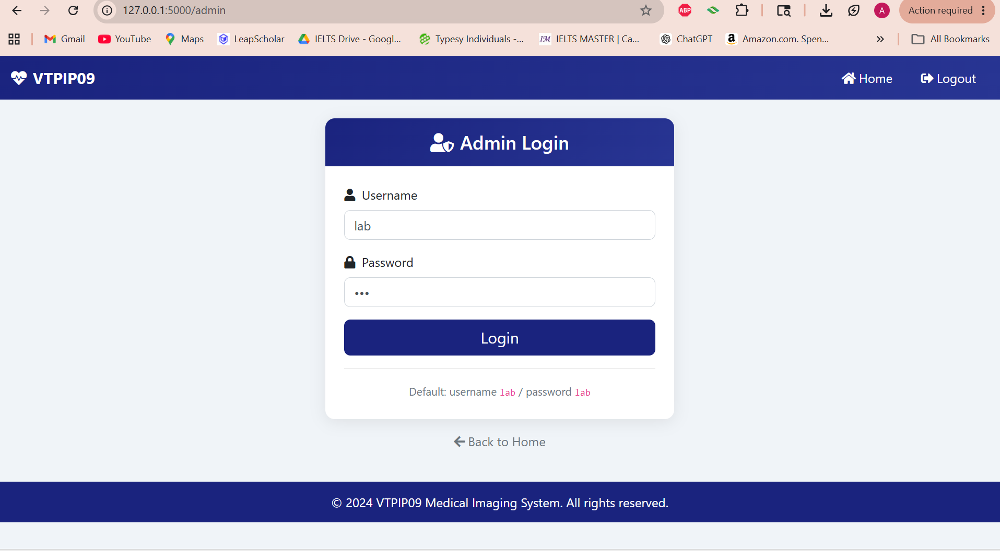
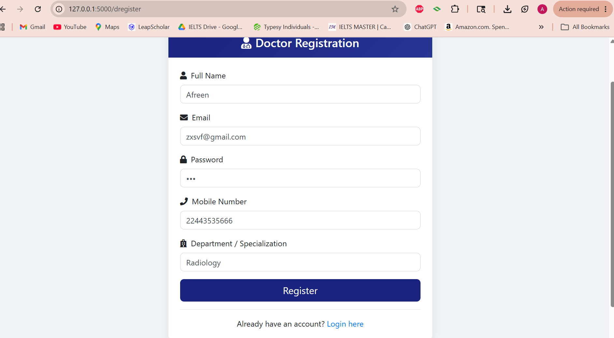
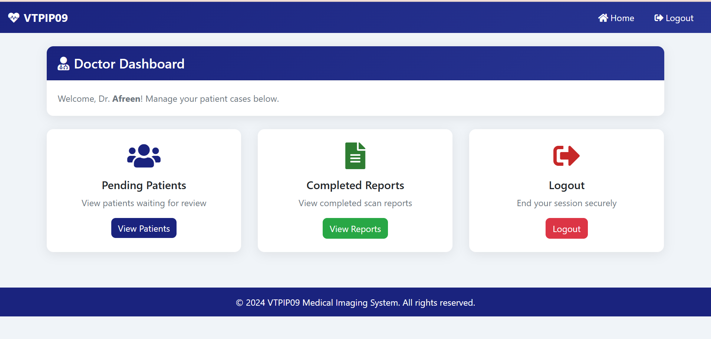
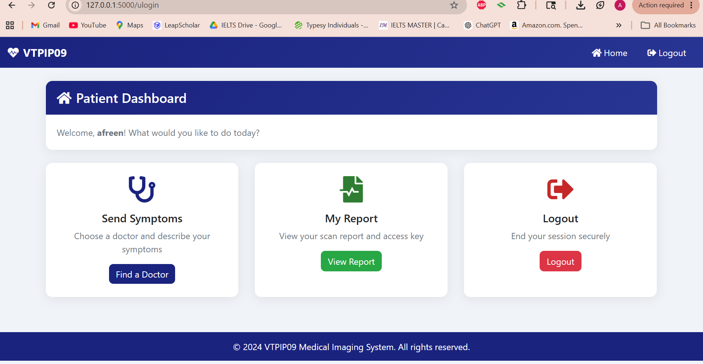

# Privacy-Preserving Deep Learning With Learnable Image Encryption on Medical Images

A healthcare AI project that protects medical scan privacy before deep learning analysis. The system encrypts a medical image before it is processed by a CNN/DNN model workflow, so raw patient scan data is not directly exposed to the server.

## GitHub About

Use this for the GitHub repository description:

```text
Privacy-preserving medical image analysis pipeline using Python, OpenCV, TensorFlow/Keras, CNN models, and learnable image encryption to protect patient scan data.
```

Suggested topics:

```text
python, flask, mysql, opencv, numpy, tensorflow, keras, cnn, deep-learning, computer-vision, medical-imaging, healthcare-ai, image-encryption, privacy-preserving-ai
```

## Project Understanding With Patient X Example

Patient X visits a hospital and receives a medical scan. The hospital wants to use AI to help analyze the scan, but Patient X's raw scan is sensitive healthcare data.

If the original scan is sent directly to a cloud server, the image may be exposed to a semi-honest server. A semi-honest server may process the data correctly, but it may still be able to observe private medical information.

This project solves that problem by encrypting Patient X's scan before the image is sent for deep learning analysis. The server receives an encrypted image instead of the raw medical scan.

## Problem Definition

Cloud-based AI systems are useful for medical image analysis, but medical images contain private patient information. The challenge is to use deep learning on medical images while reducing the risk of exposing the original scan.

The main question is:

```text
Can we protect Patient X's medical image before cloud processing and still allow a deep learning model to perform useful prediction?
```

## Existing System

Existing approaches such as SRCNN and GDSR focus mainly on image reconstruction or super-resolution quality.

| Existing Approach | What It Does | Limitation |
|---|---|---|
| SRCNN | Uses convolutional layers for super-resolution | Focuses on image quality, not privacy |
| GDSR | Uses high-frequency and low-frequency branches to improve reconstruction | Improves visual quality but does not directly protect raw medical images |
| Earlier SKK-style encryption | Attempts learnable image encryption | Some previous schemes were partially attackable |
| Raw cloud processing | Sends medical images to server for model use | Patient X's original scan may be exposed |

## Proposed System

The proposed system uses learnable image encryption before deep learning processing.

| Proposed Component | Purpose |
|---|---|
| Client-side encryption | Protect Patient X's image before it leaves the trusted side |
| Negative-positive transformation | Converts pixel values into opposite values |
| Color channel shuffling | Changes the order of image color channels |
| Statistical smoothing | Replaces local image blocks with statistical values such as median, mean, max, or min |
| DNN/CNN model workflow | Performs prediction on encrypted medical images |
| Secure report flow | Shows encrypted scan and diagnosis result to doctor and patient |

## Existing vs Proposed

| Area | Existing System | Proposed System |
|---|---|---|
| Main goal | Improve image quality or reconstruction | Protect medical image privacy during AI processing |
| Input to server | Raw or weakly protected image | Encrypted medical image |
| Privacy focus | Limited | Main design goal |
| Model direction | SRCNN/GDSR style reconstruction | DenseNet-121 and XceptionNet style DNN/CNN workflow |
| Patient X example | Patient X's scan may be visible to server | Patient X's scan is encrypted before server processing |

## Technologies Used

| Technology | Simple Explanation | Where It Is Used |
|---|---|---|
| Python | Main programming language | Backend, encryption, model logic |
| Flask | Lightweight web framework | Patient, doctor, and lab/admin portal |
| MySQL | Relational database | Users, doctors, symptom requests, scan reports |
| OpenCV | Image processing library | Reading, resizing, and encrypting images |
| NumPy | Numerical computing library | Pixel calculations and statistical filters |
| TensorFlow/Keras | Deep learning framework | DenseNet-121 and XceptionNet model workflow |
| CNN/DNN | Neural network model type for image data | Medical image prediction pipeline |
| HTML/Jinja2 | Web template rendering | Frontend pages |
| Bootstrap | UI styling framework | Dashboard layout and screens |

## System Architecture

```text
Patient X
   |
   v
Patient Portal
   |
   v
Doctor Review
   |
   v
Lab/Admin Uploads Medical Scan
   |
   v
Image Preprocessing
   |
   v
Learnable Image Encryption
   |
   v
Encrypted Medical Image
   |
   v
DNN/CNN Model Workflow
   |
   v
Diagnosis Result
   |
   v
Encrypted Report Stored in MySQL
   |
   v
Doctor and Patient View Report
```

## DNN Model Workflow

The DNN architecture represents the model stage of the project.



```text
Encrypted medical image
   |
   v
Prepare training or prediction dataset
   |
   v
Build DNN/CNN model
   |
   v
Initialize model parameters
   |
   v
Train/update parameters using optimization and backpropagation
   |
   v
Complete model training or inference
   |
   v
Output prediction result
```

In this project, Patient X's encrypted image is passed through a CNN/DNN style model workflow. The model learns image patterns through hidden layers and produces a final healthcare prediction result.

## End-to-End Workflow With Patient X

| Step | What Happens | Patient X Example |
|---|---|---|
| 1 | Patient registers and logs in | Patient X creates an account |
| 2 | Patient submits symptoms | Patient X describes symptoms |
| 3 | Doctor reviews request | Doctor accepts Patient X's case |
| 4 | Lab/Admin uploads scan | Lab uploads Patient X's scan image |
| 5 | Image is resized | Scan is resized to 256 x 256 |
| 6 | Image is encrypted | Raw scan becomes encrypted scan |
| 7 | Encrypted image is processed | DNN/CNN model workflow analyzes it |
| 8 | Diagnosis is generated | Result is Normal or Abnormal |
| 9 | Report is stored | MySQL stores encrypted filename and result |
| 10 | Report is viewed | Doctor and Patient X view encrypted scan report |

## Encryption Pipeline

| Stage | Method | Simple Meaning |
|---|---|---|
| 1 | Negative-positive transformation | Turns each pixel into its opposite value |
| 2 | Color channel shuffling | Rearranges color channels so visual meaning is harder to inspect |
| 3 | Statistical smoothing | Breaks the image into blocks and replaces each block with median, mean, max, or min values |

## Model Output

The model workflow produces:

| Output | Meaning |
|---|---|
| Encrypted scan image | Privacy-protected version of Patient X's scan |
| DenseNet-121 result | Prediction from DenseNet-121 workflow |
| XceptionNet result | Prediction from XceptionNet workflow |
| Final diagnosis | Combined result shown to doctor and patient |
| Confidence values | Model confidence or fallback analysis values |
| Access token | Secure report access key |

Example output:

```text
Uploaded scan: patient_x_scan.png
Encrypted scan: enc_patient_x_scan.png
DenseNet-121: Abnormal - Further Examination Required
XceptionNet: Normal
Final diagnosis: Abnormal - Further Examination Required
Access key: A7kP92LmQx
```

## Secure Access Key After Upload

After the lab/admin uploads Patient X's scan, the system generates a 10-character access key for the report.

This key is important because it connects the encrypted scan report to the patient and doctor workflow.

| Step | What Happens |
|---|---|
| 1 | Lab/admin uploads Patient X's medical scan |
| 2 | The system encrypts the uploaded image |
| 3 | The model workflow generates a diagnosis result |
| 4 | The system creates a 10-character report access key |
| 5 | The key is stored in the MySQL `sreport` table under the `key1` column |
| 6 | Doctor and patient can view the key from their report/request pages |

Example from a completed local run:

```text
Report ID: 3
Patient: Afreen Khan
Encrypted report key: cVORqde04j
Diagnosis: Normal
```

To check the key manually in MySQL:

```sql
USE vtpip09_2022;
SELECT id, name, uid, did, filename, key1, diagnosis FROM sreport;
```

## Evaluation Metrics

This project should be evaluated using both model performance metrics and privacy preservation metrics.

### Model Performance Metrics

| Metric | What It Shows |
|---|---|
| Accuracy | Overall correct predictions |
| Precision | How correct abnormal predictions are |
| Recall | How many actual abnormal cases are detected |
| F1-score | Balance between precision and recall |
| Confusion matrix | Normal vs abnormal prediction breakdown |
| ROC-AUC | How well the model separates classes |

Current status: classification metrics have not been generated yet because they require a labelled medical imaging evaluation dataset with multiple `Normal` and `Abnormal` images.

### Privacy and Image Quality Metrics

| Metric | What It Shows |
|---|---|
| MSE | Pixel-level difference between original and encrypted image |
| PSNR | Distortion level after encryption |
| SSIM | Structural similarity between original and encrypted image |
| Entropy | Randomness in encrypted image |
| NPCR | Pixel change rate after encryption |
| UACI | Average intensity change after encryption |

The following privacy metrics were calculated from one completed local test upload:

```text
Original image: static/orig_download.png
Encrypted image: static/enc_download.png
```

| Metric | Value |
|---|---:|
| MSE | 35474.0808 |
| PSNR | 2.6317 dB |
| SSIM | -0.4327 |
| Entropy | 6.2667 |
| NPCR | 99.9171% |
| UACI | 68.1611% |

These values show that the encrypted image is highly different from the original image, supporting the privacy-preserving goal of the project. Full classification metrics should be added after evaluating the model on a labelled medical imaging dataset.

## Screenshots

### Home Page


### Login Dashboard


### Doctor Registration


### Doctor Dashboard


### Patient Dashboard


### Patient Reports


## Folder Structure

```text
Major-project-VTPIP09/
  app.py                    Flask web application and route logic
  encryption.py             Learnable image encryption pipeline
  model.py                  DenseNet-121 and XceptionNet diagnosis workflow
  requirements.txt          Core app dependencies
  requirements-ml.txt       Optional TensorFlow/Keras dependency
  vtpip09_2022_setup.sql    MySQL database setup
  update_db.sql             Report table update script
  templates/                HTML/Jinja2 web pages
  Screenshots/              Project output screenshots
  docs/                     Beginner explanation, metrics plan, GitHub polish
  VTPIP09.docx              Original academic project documentation
```

## Installation

### 1. Clone the Repository

```bash
git clone https://github.com/27-Afreen/Major-project-VTPIP09.git
cd Major-project-VTPIP09
```

### 2. Create a Virtual Environment

```bash
python -m venv .venv
.venv\Scripts\activate
```

### 3. Install Core Dependencies

```bash
pip install -r requirements.txt
```

### 4. Optional: Install ML Dependencies

TensorFlow is separated because it is larger than the normal web app dependencies.

```bash
pip install -r requirements-ml.txt
```

### 5. Configure Environment Variables

Create a `.env` file using `.env.example` as the template.

```text
FLASK_SECRET_KEY=change-this-local-secret
DB_HOST=localhost
DB_PORT=3307
DB_USER=root
DB_PASSWORD=your_mysql_password
DB_NAME=vtpip09_2022
```

### 6. Start MySQL and Set Up Database

```bash
net start MySQL
```

Run the SQL setup scripts in MySQL:

```sql
SOURCE path/to/vtpip09_2022_setup.sql;
SOURCE path/to/update_db.sql;
```

## How to Run

```bash
python app.py
```

Open:

```text
http://127.0.0.1:5000
```

## Main Web Routes

This is a Flask web app, so the project uses web routes instead of a pure REST API.

| Route | Purpose |
|---|---|
| `/` | Home page |
| `/user` | Patient login page |
| `/doctor` | Doctor login page |
| `/admin` | Lab/admin login page |
| `/uregister` | Patient registration |
| `/dregister` | Doctor registration |
| `/udoc` | Patient selects doctor |
| `/usend` | Patient submits symptoms |
| `/sreport` | Lab/admin views cases ready for scan upload |
| `/send` | Lab/admin uploads scan and generates encrypted report |
| `/display` | Doctor views encrypted scan report |
| `/udisplay` | Patient views encrypted scan report |

## Skills This Project Proves

| Skill | How This Project Proves It |
|---|---|
| Python | Backend logic, encryption module, model workflow |
| Flask | Web app routes and user workflows |
| MySQL | Database schema, user records, report storage |
| OpenCV | Image reading, resizing, and transformation |
| NumPy | Pixel-level statistical operations |
| TensorFlow/Keras | Deep learning model workflow |
| CNN/DNN | Medical image prediction architecture |
| Healthcare AI | Medical scan analysis use case |
| Privacy-preserving ML | Encrypted image processing before model use |
| Secure data workflow | Raw patient scan exposure is reduced |
| Documentation | Beginner-friendly explanation, workflow, metrics plan |

